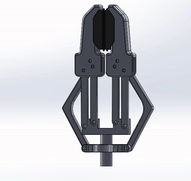

# Parallel Linkage End Effector 🦾

This repository contains the design, CAD files, and motion study for a **Parallel-Jaw Robotic Gripper**. The mechanism is engineered to ensure that the gripping surfaces remain perfectly parallel throughout their entire range of motion, providing a stable and predictable grip for industrial or research applications.



## 🚀 Overview
The design features a robust **four-bar linkage system** (pantograph style) that converts vertical actuation into synchronized horizontal clamping. This specific geometry is ideal for handling objects of varying sizes without needing to adjust the angle of the robotic wrist.

### Key Features
* **Parallel Kinematics:** Gripping pads remain parallel to prevent object ejection.
* **High Precision:** Minimized backlash through optimized pivot points.
* **Lightweight & Modular:** Designed for easy prototyping via 3D printing (PLA/PETG) or CNC machining.
* **Symmetric Actuation:** Single-point drive mechanism for balanced force distribution.

---

## 🛠 Technical Specifications
| Feature | Specification |
| :--- | :--- |
| **Type** | Parallel Motion Gripper |
| **Linkage Type** | Dual Four-Bar Linkage |
| **Max Opening** | [e.g., 50mm] |
| **Mounting Interface** | [e.g., ISO 9409-1-50-4-M6] |
| **Material Used** | [e.g., Aluminum 6061 / 3D Printed Carbon PA] |

---

## ⚙️ Mechanical Principle
The gripper operates on a **Parallel Linkage** principle. Unlike standard "swing" grippers where the jaws rotate, this mechanism uses a secondary link to constrain the finger orientation. 


1.  **Input:** Vertical movement from a central lead screw or servo horn.
2.  **Transmission:** The inner and outer linkages distribute the force.
3.  **Output:** Linear, parallel displacement of the gripping pads.

---

## 🔧 Installation
1.  **Clone the Repo:**
    ```bash
    git clone [https://github.com/YOUR_USERNAME/YOUR_REPO_NAME.git](https://github.com/YOUR_USERNAME/YOUR_REPO_NAME.git)
    ```
2.  **Fabrication:** Print the parts found in `/CAD` with at least 40% infill for mechanical strength.
3.  **Assembly:** Use M3 bolts and bearings for the pivot points to ensure smooth motion.

---

## 💡 Future Improvements
- [ ] Add integrated force sensors (FSR) for delicate object handling.
- [ ] Design interchangeable "soft-grip" pads for organic shapes.
- [ ] Implement ROS2 controller nodes for automated grasping.

---

## 🤝 Contributing
Contributions are welcome! If you have ideas for improving the kinematics or reducing the part count, feel free to open a **Pull Request**.

---
**Developed by [Il Tuo Nome/Username]** - *Web & Robotics Enthusiast*
